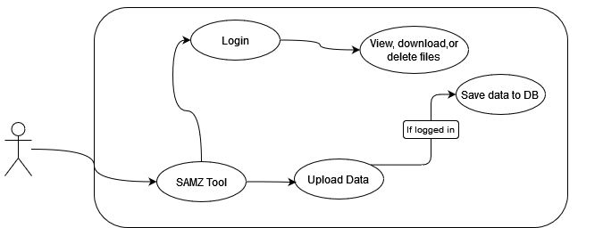

[](https://classroom.github.com/online_ide?assignment_repo_id=5893942&assignment_repo_type=AssignmentRepo)
# CS178A-B-Template

## Table of Contents
- [Overview](#overview)
- [Usage](#usage)
- [How To Run](#how-to-run)
- [Diagrams](#diagrams)
- [Dependencies](#dependencies)

## Overview
This is the Irrigation Water Management Tool Suite. It's a site that hosts tools that help farmers make better decisions about their farms. These tools were also created to tackle California's water scarcity problems.

The first tool is in collaboration with Dr. Akansha Garg from the [Hanghverdi Water Management Group](https://ucrwater.com). With her guidance, we developed an advanced version of the SAMZ-Desert Tool. This is a tool for agricultural management zones that relies on NDVI satellite data. The old implementaion only worked on specific fields in Imperial County. We expanded on the tool and allowed users to upload their own field data. Now the tool can be used by farmers from around the world.

## Team Advisors
<a href="https://github.com/msalloum" target="_blank">Mariam Salloum </a>

<a align="left" href="https://ucrwater.com" target="_blank">Dr. Akanksha Garg</a> 

## Team 
<a href="https://github.com/RobertNavarro" target="_blank">Robert Navarro</a>

<a href="https://github.com/seabass04" target="_blank">Sebastian Garcia</a>

<a href="https://github.com/daniel-nis" target="_blank">Daniel Nissan</a>

<a href="https://github.com/jc2673528" target="_blank">Juan Castellon</a>
## Usage
Demo: <Link to youtube video>


## How To Run
Start off by installing Python 3.10 and running
```
pip install pandas numpy matplotlib scikit-learn
```

After that, install Node.js version 16.13.1. The latest version should also be fine.

Once you have Python and Node.js installed go ahead and download all of our code from github.

Then, from the project directory you want to run
```
npm install
```
This will install all the necessary packages for the frontend of the project. The backend has it's packages it needs so navigate to the backend folder. Run the install command from the backend folder.

Now you should have all the packages you need to get the project running.

You should still be in the backend folder. Run the command
```
npm start
```
to get the backend server running. You should see an output in the terminal if it was successful.

Open another terminal, but do not close the terminal of the backend. In this new terminal make sure you are at the root of the project folder. We want to get the frontend server running now.

From the root, run
```
npm run build
```
This will build the app for production to the build folder.

We're almost done! Now run
```
npm start
```
again to get the frontend server started. You should see an output in the terminal if it was successful. Simply click the link that gets outputed to be brought to the website.

## Diagrams

Sequence Diagram  

  
Overall System Diagram

  
Frontend Structure


## Dependencies
[Python 3.10](https://www.python.org/downloads/release/python-3100/)  
[Node.js version 16.13.1](https://nodejs.org/download/release/v16.13.1/)

